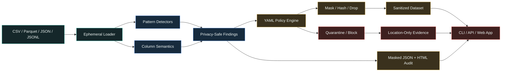

# PrivacyLens

[](https://www.python.org/)
[](https://github.com/Robertcurzon/privacylens/actions)
[](#privacy-guarantees)
[](LICENSE)

**PrivacyLens** is a local-first sensitive-data discovery and sanitization toolkit for CSV, Parquet, JSON, and JSONL files. It inventories PII and credentials, evaluates policy-as-code, masks or hashes selected values, isolates unsafe rows, and creates audit evidence without retaining raw matches in its reports.

It is designed for data engineers, analytics teams, consultants, and developers who need to inspect a file before sharing it, publishing it, loading it into a warehouse, or sending it to another service.

## What It Does

- Detects email addresses, phone numbers, IP addresses, US SSNs, payment cards using Luhn validation, provider tokens, JWTs, names, addresses, birth dates, and precise-location fields.
- Combines conservative value-level detection with column semantics instead of relying on headers alone.
- Applies explicit actions by category or column: `allow`, `report`, `mask`, `hash`, `drop`, `quarantine`, or `block`.
- Produces sanitized datasets while keeping quarantined evidence free of original row values.
- Generates JSON and portable HTML reports containing only masked previews and HMAC fingerprints.
- Deletes hosted raw uploads immediately after in-memory processing.
- Runs through an installable Python API, CLI, multipart JSON API, or responsive web interface.
- Uses no LLM for detection or policy decisions.

## Architecture



## Quickstart

```bash
git clone https://github.com/Robertcurzon/privacylens.git
cd privacylens
python -m venv .venv
source .venv/bin/activate
pip install -r requirements.txt
uvicorn web.app:app --reload
```

Open [http://localhost:8000](http://localhost:8000). The initial page contains a complete masked audit of a synthetic customer file, so the product is useful before uploading anything.

## CLI

Inventory a file without changing it:

```bash
privacylens scan customers.csv \
  --json privacy-report.json \
  --html privacy-report.html
```

Sanitize using the conservative built-in policy:

```bash
privacylens sanitize customers.csv \
  --output customers.safe.parquet \
  --report privacy-report.json
```

Use a custom policy:

```bash
privacylens sanitize customers.csv \
  --policy data/sample/privacy_policy.yaml \
  --output customers.safe.csv
```

Replay the bundled incident:

```bash
privacylens demo --mode audit
```

`sanitize` exits with status `2` and does not write a sanitized dataset when a `block` action is triggered.

## Policy Format

```yaml
name: safe-customer-share
version: "1.0"
default_action: report
rules:
  email: mask
  phone: mask
  person_name: mask
  ip_address: hash
  government_id: quarantine
  payment_card: quarantine
  credential: block
```

Rules can also be written as a list when a policy should target particular columns:

```yaml
rules:
  - category: email
    action: mask
    columns: [billing_email]
  - category: email
    action: allow
    columns: [support_alias]
```

Actions are resolved from top to bottom; the first category-and-column match wins.

## Python API

```python
import pandas as pd

from privacylens import redaction_policy, sanitize_frame, scan_frame

frame = pd.read_csv("customers.csv")
report = scan_frame(frame, source_name="customers.csv")
result = sanitize_frame(frame, report, redaction_policy())

print(report.risk_level, report.category_counts)
if result.decision.status != "blocked":
    result.sanitized.to_parquet("customers.safe.parquet", index=False)
```

## JSON API

| Endpoint | Purpose |
|---|---|
| `GET /health` | Deployment health check |
| `POST /api/scan` | Multipart upload returning a non-persistent masked report |
| `POST /analyze` | Web workflow with audit, sanitize, and strict modes |
| `GET /api/runs` | Saved run manifests |
| `GET /api/runs/{run_id}` | Complete masked report and policy result |
| `GET /artifacts/{run_id}/{filename}` | Whitelisted report or sanitized output |

Example:

```bash
curl -F data_file=@customers.csv http://localhost:8000/api/scan
```

## Privacy Guarantees

PrivacyLens is deliberately bounded:

- Raw matched values are never included in `report.json` or the HTML report.
- Finding fingerprints use HMAC-SHA256. Set `PRIVACYLENS_HASH_KEY` when stable cross-run correlation is required.
- Without a configured key, a new random key is created for each scan, preventing cross-run linkage.
- Quarantine artifacts contain row numbers and category reasons only, not copies of rejected source rows.
- The web app removes raw uploaded files in a `finally` block after processing.
- Detection and enforcement are deterministic and local. No input is sent to an LLM.
- A successful scan does not prove that a dataset is anonymous or legally compliant. Human review remains necessary for high-risk releases.

## Detection Boundaries

Deterministic detection is intentionally explainable, but no scanner can identify every sensitive value or resolve every context correctly. Column semantics improve recall for structured data; format checks and Luhn/SSN validation reduce common false positives. The `masked_preview`, detector name, confidence, location, and policy action remain visible so reviewers can challenge the result.

## Public Deployment

`render.yaml` defines a simple public deployment. The same command works on Railway or another Python host:

```bash
uvicorn web.app:app --host 0.0.0.0 --port $PORT
```

The hosted demo should be treated as ephemeral. For production, use persistent encrypted storage, set `PRIVACYLENS_HASH_KEY`, enforce upload limits at the proxy, and place authentication in front of the service.

## Engineering Quality

```bash
pip install -e ".[dev]"
ruff check .
pytest --cov=privacylens --cov-report=term-missing
```

CI tests Python 3.11 and 3.12 on every push and pull request.

## License

[MIT](LICENSE)
